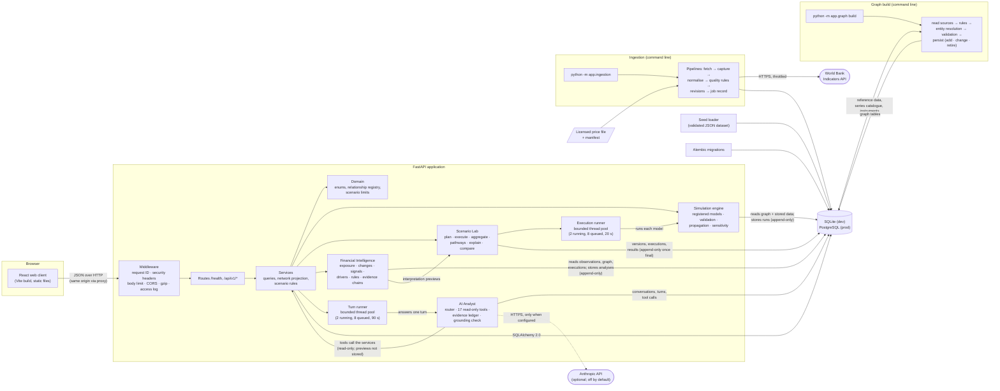

# Architecture

RUMIN is a web client and a JSON API over a relational database, with a command-line
ingestion pipeline that fills the database from data providers. Phase 1 built the skeleton;
Phase 2 added the financial data infrastructure (providers, ingestion, provenance, quality,
the read API and the Data Explorer — see [the data architecture](data/architecture.md));
Phase 3 added the knowledge graph, built from those records by another command and stored
in the same database ([the graph architecture](graph/architecture.md)). Phase 4 added the
simulation engine: registered, versioned models run through the API, reading the graph and
stored data, with every run stored append-only in the same database
([the simulation architecture](simulation/architecture.md)). Phase 5 added the Scenario
Lab: versioned scenarios executed through the model registry on a bounded background worker
pool, with their results, pathways, explanations, sensitivity analyses and comparisons
([the Scenario Lab architecture](scenario-lab/architecture.md)). Phase 6 added Financial
Intelligence: a read-only analysis layer over the stored observations, the graph and the
executions, whose findings each carry the evidence chain they rest on, with stored analyses
as append-only snapshots ([the intelligence architecture](intelligence/architecture.md)).
Phase 7 added the AI Analyst: questions answered through an allowlist of read-only tools over
those services, every figure cited and checked against its evidence, on a second bounded
worker pool, with conversations stored in the same database and an optional Claude model
behind a provider interface ([the Analyst's architecture](analyst/architecture.md)). Later
phases — the 3D universe (8) — extend it without restructuring it.



The API never contacts a provider and never writes the graph: only the command line does,
so no anonymous HTTP client can make RUMIN send requests or change data it did not ask for
(there is no authentication yet). The graph API is read-only. The API's writes are
scenarios and their versions (a save never overwrites: it adds a version), and — since
Phase 4 — simulation runs, scenario executions and sensitivity analyses, which are
append-only once final and never change the data or the graph they read. Phase 6 adds
stored intelligence analyses, append-only snapshots; every other intelligence read writes
nothing. Phase 7's Analyst writes only its own conversations (a turn is final once
answered); its tools read, and its one compute tool previews a scenario without storing it.
The API contacts one outside service, and only when configured to: the Anthropic API, for
the Analyst's optional language model.

## Backend (`backend/app`)

Layered so that each layer depends only on the ones below it:

| Layer | Package | Responsibility |
|---|---|---|
| HTTP | `api/` | Routes, parameters, status codes, OpenAPI descriptions. No SQL, no business rules. |
| Contract | `schemas/` | Pydantic models for every request and response: validation, serialisation, the OpenAPI schema. |
| Services | `services/` | Queries and use cases: reference data, the network projection, scenarios and their versions, the Scenario Lab (plans, previews, executions, results, pathways, explanations, sensitivity, comparisons, templates), system status, the graph's read logic (limits, filters, explanations), the simulation API (runs, explanations, verification, sensitivity), Financial Intelligence (overview, dossiers, briefs, thresholds, stored analyses and their freshness) and the AI Analyst (its runtime, conversations and turns). |
| Domain | `domain/` | Pure definitions: enumerations, the relationship-type registry (what each edge type means and may connect), the graph's node, edge and evidence-status registry, scenario change limits. |
| Persistence | `models/`, `db/` | SQLAlchemy ORM models, session management, portable column types (UTC datetimes, exact decimals), the seed loader. |
| Ingestion | `ingestion/` | Providers, HTTP with throttling and retries, normalisation, quality rules, persistence with revisions, job tracking, the command line ([details](data/architecture.md)). |
| Graph | `graph/` | The knowledge graph: construction rules, entity resolution, validation, persistence, the build command, algorithms (BFS, paths, components) and the typed read interface the API and the simulation engine use ([details](graph/architecture.md)). |
| Simulation | `simulation/` | The simulation engine: the versioned model registry and five models, exact-decimal arithmetic, units, input validation, controlled propagation through confirmed graph relationships, timed changes and percentage-point shocks, execution with every step recorded, Shapley contributions, sensitivity analysis, explanations and append-only persistence ([details](simulation/architecture.md)). |
| Scenario Lab | `scenario_lab/` | The scenario specification and its validation, the planner (which models apply and why), scenario profiles, the executor and its stages, the bounded runner, the Lab's aggregation equations, pathways, explanations, one-at-a-time sensitivity, comparison and templates ([details](scenario-lab/architecture.md)). |
| Financial Intelligence | `intelligence/` | The read-only analysis layer: exact statistics, thresholds, the evidence model (steps, grades, `ChainError`), validated graph slices, exposure paths, changes and revisions, relationship changes, drivers from stored contributions, signals, the 19 insight rules, the model interpretation of observed changes, the module registry, the two scopes (entity, workspace) and the brief ([details](intelligence/architecture.md)). |
| AI Analyst | `analyst/` | Question policy, vocabulary and parsing, the router and the conversation's focus, the tool registry and 17 tools over the services, the evidence ledger, answer blocks, the grounded composer, the grounding check, the providers (grounded, Anthropic, scripted), the orchestrator of one turn, the bounded turn runner and the evaluation set ([details](analyst/architecture.md)). |
| Cross-cutting | `core/` | Settings, logging, error envelope and handlers, middleware. |

Request lifecycle: the **middleware** assigns a request ID, enforces the body-size limit
and adds security headers → FastAPI **validates** the input against the schemas → the
route calls a **service** with a database session (one per request, via dependency
injection) → the service returns ORM objects or domain data → the response **schema**
serialises them. Any failure becomes the standard error envelope (see [api.md](api.md)),
logged with the request ID; unexpected exceptions never leak a stack trace.

`create_app(settings)` builds the application from explicit settings, so tests create
isolated instances with their own database; `app.main:app` is the default instance for
uvicorn.

### Rules that live in one place

- **Relationship semantics** — `domain/relationship_types.py` defines each type's label,
  direction, whether it has a polarity, and which entity kinds it may connect. The seed
  loader, the API (`/api/v1/relationship-types`) and the frontend legend all read it.
- **Scenario limits** — `domain/scenario_rules.py` defines what a variable accepts. The
  server enforces the rules and publishes them on each variable (`scenario_rules`); the
  Scenario Lab shows the published range and the server's message on the field it
  concerns, and applies no domain rule of its own. The integration tests prove that the
  server refuses each invalid input on the field the builder shows it.
- **Scenario profiles** — `scenario_lab/profiles.py` declares, for each model, the
  variables it accepts, the line items it contributes to (from a closed list, so no two
  models can claim the same item) and the graph exposure that makes it apply. The planner,
  the aggregation, the templates and the pathway all read it.
- **Graph vocabulary** — `domain/graph_types.py` defines the 9 node types, 18 edge types
  (meaning, endpoints, direction, allowed evidence statuses, caveat) and 4 evidence
  statuses. The build validates against it and the API serves it (`/api/v1/graph/types`,
  and on every edge). The explorer shows the labels, meanings and caveats the API sends;
  it only chooses how to draw them, and never decides what a relationship means.
- **Model definitions** — `simulation/models/` defines each model's inputs (units,
  ranges, defaults and their rationales), equations, outputs, graph rules, assumptions and
  limitations. The engine validates and calculates with them, the API serves them
  (`/api/v1/simulation-models/{id}`), and the Simulation page builds its form, pathway and
  tables from what it receives. No financial figure is calculated in the browser.
- **Honesty** — capabilities (`services/system.py`) state what exists and what is planned
  for which phase; the UI reads them rather than hard-coding claims.
- **What the Analyst may say** — `analyst/policy.py` holds the forbidden phrasings and every
  refusal's text, `analyst/grounding.py` the one check every answer passes, and
  `analyst/tools/__init__.py` the allowlist. A provider can draft; only these decide what is
  shown.

## Frontend (`frontend/src`)

React 19 + TypeScript, built by Vite, routed by React Router (data router, lazily loaded
pages).

| Folder | Contents |
|---|---|
| `app/` | Route table, theme and motion preferences, the module registry (names, status, phase of each product area) |
| `layouts/` | The application shell: header, navigation, live workspace status, footer |
| `pages/` | One component per route: Landing, Overview, Universe (2D network, and the 3D universe of the knowledge graph), Knowledge Graph, Data Explorer (with series, instrument and ingestion-run pages), Simulation (with a stored run's page), Scenario Lab, Financial Intelligence (the workspace, a dossier, a stored analysis), AI Analyst, System, not-found and error pages |
| `features/network/` | Everything about the financial network (below) |
| `features/graph/` | The Knowledge Graph explorer: its state and history, the view model, deterministic layouts, encoding, canvas and panels ([details](graph/explorer.md)) |
| `features/universe/` | The 3D universe: strata, the 3D layout, the scene model, camera maths, keyboard navigation, name placement, the overlay of a stored execution (all pure), the whole-build and overlay loaders, the canvas host and the lazily loaded Three.js renderer ([details](universe/architecture.md)) |
| `features/data/` | The time-series chart and its arithmetic, exact-value tables, provenance, freshness and quality components |
| `features/scenarioLab/` | The Scenario Lab: the draft model and its conversion to the API body (pure), the builder, the live preview and execution hooks, the pathway layout (pure) and canvas, the results panel, execution strip, timeline and the analysis, explanation, history and comparison views ([details](scenario-lab/interface.md)) |
| `features/intelligence/` | Financial Intelligence: the findings ledger and the evidence chain, grade marks, the exposure matrix and paths, drivers, signals, history, sources and the brief, the thresholds panel and subjects, the dashboard's latest findings, and display formatting that only rounds the API's exact strings ([details](intelligence/interface.md)) |
| `features/analyst/` | The AI Analyst: the conversation hook (ask, poll `poll_after_ms`, follow a pending turn), notes, answer blocks, the evidence margin and knowledge marks, the method trace, Markdown export, and figures written with the API's rounding ([details](analyst/interface.md)) |
| `features/simulation/` | The Simulation preview: the input form built from a model definition, exact-decimal formatting, the pathway layout, the result tables and charts, provenance and sensitivity panels ([details](simulation/preview.md)) |
| `components/` | Shared UI primitives |
| `hooks/` | `useApiResource` (shared request cache), element size, media queries |
| `lib/`, `services/` | The typed HTTP client, exact-decimal formatting, and the one module that knows API paths |
| `types/` | Types generated from the OpenAPI contract, plus friendly aliases |
| `styles/` | Design tokens and global styles ([design-system.md](design-system.md)) |

**Data flow.** Pages call `useApiResource(key, loader)`, which deduplicates identical
requests, caches results for instant back-navigation, keeps old data visible while
refreshing, and exposes `loading` / `success` / `error` states that every page renders
explicitly. Loaders call `services/api.ts`, which calls `lib/apiClient.ts`: timeouts,
cancellation, and conversion of every failure into a typed `ApiError` (unreachable,
timeout, HTTP error with the envelope's code and details).

### The network pipeline

```
GET /api/v1/network
  → validateNetwork()    integrity check at the boundary: unique IDs, known types,
                         no edge pointing to a missing node (else a clear error state)
  → buildGraphModel()    indexes: nodes by ID, edges by ID, incident edges per node
  → computeLayout()      layered columns + barycentric ordering + short force relaxation
                         (deterministic: same data, same picture; ~20 ms, run once)
  → transposeLayout()    the same positions rotated for portrait phones
  → NetworkCanvas (SVG)  rendering, selection/dimming, hover, pan/zoom, keyboard
```

The model and layout are pure functions with no React or DOM dependency, cached per
payload and shared by the landing page, the dashboard preview and the Universe. The
renderer only consumes plain coordinates. (Phase 8's 3D universe is drawn from the
knowledge graph instead of this network — it carries provenance and evidence for every
record — and reuses the graph explorer's state and panels; see below.)

### The graph explorer

The explorer (`/graph`) draws only what the graph API returns. Its state is a small
snapshot (mode, focus, depth, expansions, selection, path query) with a history list;
server answers are cached by request; the view is derived from the snapshot and the
answers (`view.ts`), then laid out deterministically (`layout.ts`: a radial tree for
neighbourhoods, columns for paths). Traversal and filtering happen on the server, so the
frontend holds no relationship logic. See [the explorer](graph/explorer.md).

### The 3D universe

The universe (`/universe/3d`) is a view over the same graph API as the explorer, with the
explorer's state (`useGraphExplorer`) and panels. The meaning of every mark is decided in
plain data (`scene.ts`); a small renderer contract hides Three.js, which is imported only
when the canvas mounts and WebGL 2 is present, and renders only when something changes.
Scenario overlays read stored executions only. See [the universe](universe/architecture.md).

## Contract between the two

The API's OpenAPI document is committed (`docs/api/openapi.json`). A backend test fails if
the application no longer matches it; `npm run generate:api` turns it into TypeScript
types; CI fails if the generated types are out of date; and the integration suite checks
live responses against it. A change to the API therefore shows up as a type error in the
frontend, not as a runtime surprise.

## Configuration and environments

All settings come from environment variables (one `.env` for both applications; see
[environment.md](environment.md)). In development the Vite server proxies API calls, so
the browser uses a single origin. For production the intended shape is the same: static
files and the API behind one origin (a reverse proxy), PostgreSQL as the database, docs
optionally disabled — containerisation and deployment are Phase 10 work.

## Knowledge categories as architecture

The five epistemic categories are part of the data model, not decoration: relationships
are stored and served as `assumption`, scenario shocks as `scenario_input`, and provider
data (Phase 2) as `observation` — in its own tables, with its source, licence and
revision history. Review ranges on series are labelled as assumptions. Simulation runs
(Phase 4) are stored in their own tables: every input carries what it is (scenario input,
historical data, the user's figure, assumption or setting) and where it came from, and
every output is `derived` (from the inputs alone) or `simulated` (under the scenario),
shown with the simulated-output badge the UI already had. Scenario Lab executions (Phase
5) keep the same labels: a scenario's changes are scenario inputs, its baselines are the
user's figures held constant (inputs, not forecasts), every scenario value is simulated,
and graph relationships the Lab only cites are served as `context_only`, apart from the
ones the engine propagated along. Financial Intelligence (Phase 6) carries the categories
into its findings: every step of an evidence chain has a basis (observation, calculation,
relationship with its evidence status, record, simulation, assumption, threshold), and every
finding is graded by its weakest step, so an observed change, a stated exposure, a simulated
result and a model interpretation are never presented as the same kind of knowledge.
