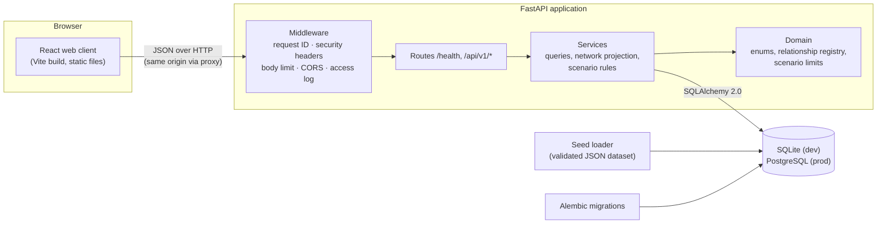

# Architecture

RUMIN is a web client and a JSON API over a relational database. Phase 1 builds the
skeleton that later phases extend — data ingestion (2), graph analytics (3), the
simulation engine (4), the AI analyst (7), the 3D universe (8) — without restructuring it.



## Backend (`backend/app`)

Layered so that each layer depends only on the ones below it:

| Layer | Package | Responsibility |
|---|---|---|
| HTTP | `api/` | Routes, parameters, status codes, OpenAPI descriptions. No SQL, no business rules. |
| Contract | `schemas/` | Pydantic models for every request and response: validation, serialisation, the OpenAPI schema. |
| Services | `services/` | Queries and use cases: reference data, the network projection, scenario validation and persistence, system status. |
| Domain | `domain/` | Pure definitions: enumerations, the relationship-type registry (what each edge type means and may connect), scenario change limits. |
| Persistence | `models/`, `db/` | SQLAlchemy ORM models, session management, portable column types, the seed loader. |
| Cross-cutting | `core/` | Settings, logging, error envelope and handlers, middleware. |

Request lifecycle: the **middleware** assigns a request ID, enforces the body-size limit
and adds security headers → FastAPI **validates** the input against the schemas → the
route calls a **service** with a database session (one per request, via dependency
injection) → the service returns ORM objects or domain data → the response **schema**
serialises them. Any failure becomes the standard error envelope (see [api.md](api.md)),
logged with the request ID; unexpected exceptions never leak a stack trace.

`create_app(settings)` builds the application from explicit settings, so tests create
isolated instances with their own database; `app.main:app` is the default instance for
uvicorn.

### Rules that live in one place

- **Relationship semantics** — `domain/relationship_types.py` defines each type's label,
  direction, whether it has a polarity, and which entity kinds it may connect. The seed
  loader, the API (`/api/v1/relationship-types`) and the frontend legend all read it.
- **Scenario limits** — `domain/scenario_rules.py` defines what a variable accepts. The
  server enforces the rules and publishes them on each variable (`scenario_rules`), and
  the Scenario Lab validates with the published values. The integration tests prove that
  browser and server reject the same inputs on the same fields.
- **Honesty** — capabilities (`services/system.py`) state what exists and what is planned
  for which phase; the UI reads them rather than hard-coding claims.

## Frontend (`frontend/src`)

React 19 + TypeScript, built by Vite, routed by React Router (data router, lazily loaded
pages).

| Folder | Contents |
|---|---|
| `app/` | Route table, theme and motion preferences, the module registry (names, status, phase of each product area) |
| `layouts/` | The application shell: header, navigation, live workspace status, footer |
| `pages/` | One component per route: Landing, Overview, Universe, Scenario Lab, AI Analyst, System, not-found and error pages |
| `features/network/` | Everything about the financial network (below) |
| `features/scenarios/` | Scenario editor state and rules (pure), the editor and its context panel |
| `components/` | Shared UI primitives |
| `hooks/` | `useApiResource` (shared request cache), element size, media queries |
| `lib/`, `services/` | The typed HTTP client and the one module that knows API paths |
| `types/` | Types generated from the OpenAPI contract, plus friendly aliases |
| `styles/` | Design tokens and global styles ([design-system.md](design-system.md)) |

**Data flow.** Pages call `useApiResource(key, loader)`, which deduplicates identical
requests, caches results for instant back-navigation, keeps old data visible while
refreshing, and exposes `loading` / `success` / `error` states that every page renders
explicitly. Loaders call `services/api.ts`, which calls `lib/apiClient.ts`: timeouts,
cancellation, and conversion of every failure into a typed `ApiError` (unreachable,
timeout, HTTP error with the envelope's code and details).

### The network pipeline

```
GET /api/v1/network
  → validateNetwork()    integrity check at the boundary: unique IDs, known types,
                         no edge pointing to a missing node (else a clear error state)
  → buildGraphModel()    indexes: nodes by ID, edges by ID, incident edges per node
  → computeLayout()      layered columns + barycentric ordering + short force relaxation
                         (deterministic: same data, same picture; ~20 ms, run once)
  → transposeLayout()    the same positions rotated for portrait phones
  → NetworkCanvas (SVG)  rendering, selection/dimming, hover, pan/zoom, keyboard
```

The model and layout are pure functions with no React or DOM dependency, cached per
payload and shared by the landing page, the dashboard preview and the Universe. The
renderer only consumes plain coordinates, so a **Three.js renderer (Phase 8)** can reuse
the model, the filters, the selection state and the layout (or a 3D extension of it)
without touching the data layer; the layout can also move to a Web Worker when graphs grow.

## Contract between the two

The API's OpenAPI document is committed (`docs/api/openapi.json`). A backend test fails if
the application no longer matches it; `npm run generate:api` turns it into TypeScript
types; CI fails if the generated types are out of date; and the integration suite checks
live responses against it. A change to the API therefore shows up as a type error in the
frontend, not as a runtime surprise.

## Configuration and environments

All settings come from environment variables (one `.env` for both applications; see
[environment.md](environment.md)). In development the Vite server proxies API calls, so
the browser uses a single origin. For production the intended shape is the same: static
files and the API behind one origin (a reverse proxy), PostgreSQL as the database, docs
optionally disabled — containerisation and deployment are Phase 10 work.

## Knowledge categories as architecture

The five epistemic categories are part of the data model, not decoration: relationships
are stored and served as `assumption`, scenario shocks as `scenario_input`; there is no
storage for `observation` or `simulated_output` yet because nothing produces them. When
the Phase 2 ingestion and Phase 4 engine arrive, they get their own tables and labels, and
the UI's badges already know how to show them.
