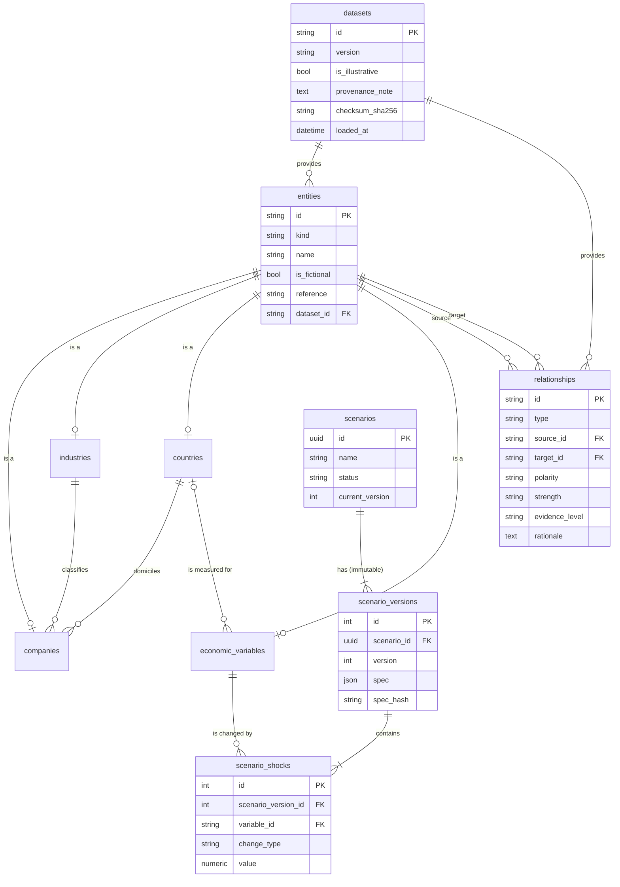
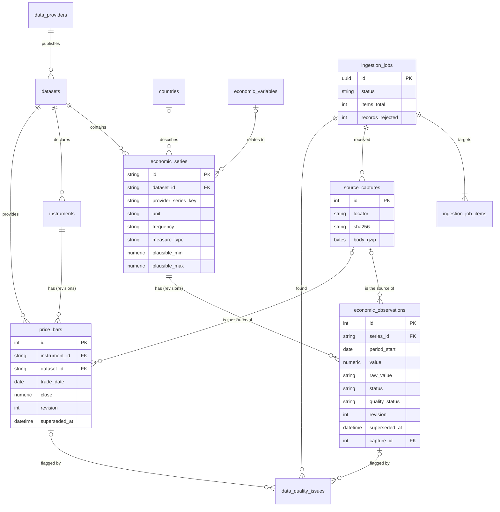
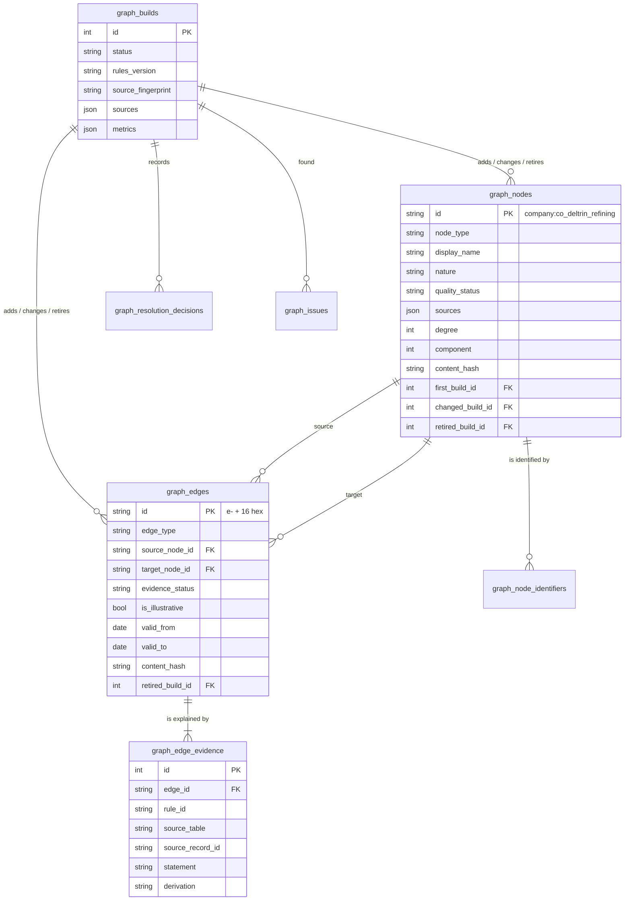
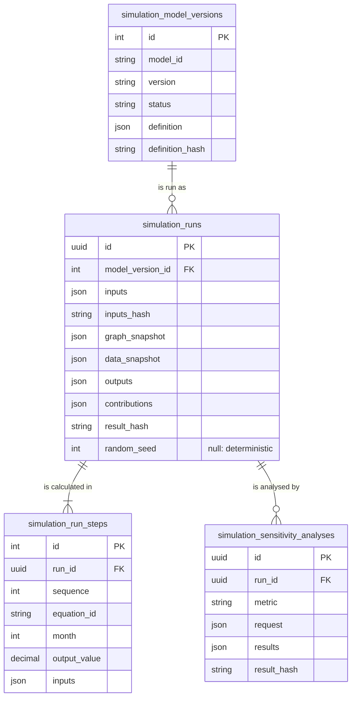
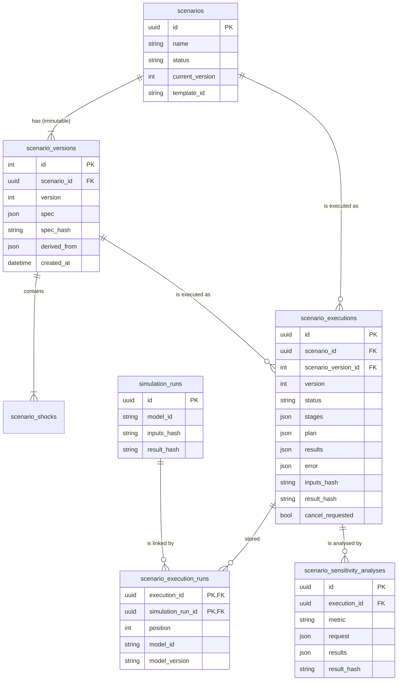
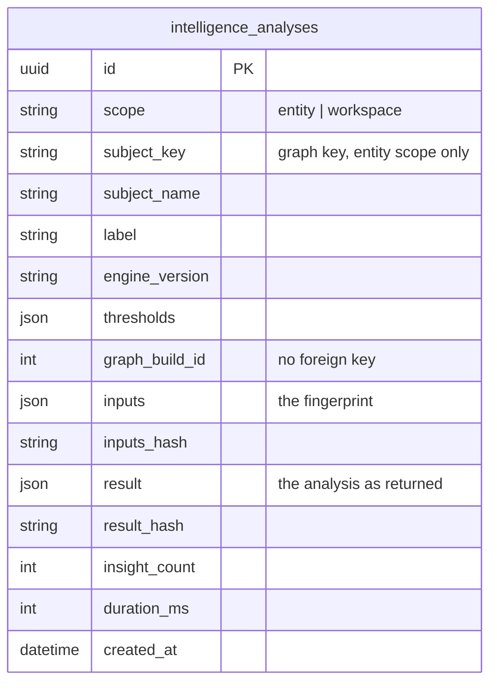
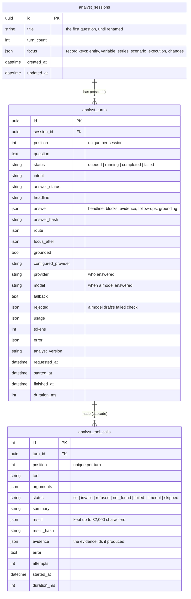
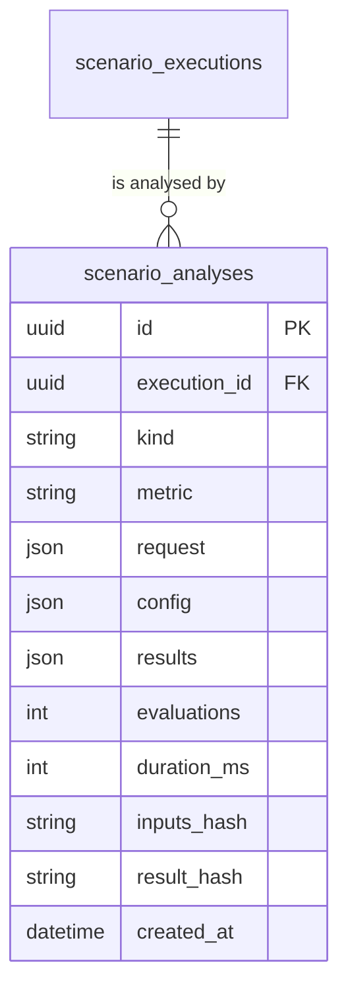

# Data model

Phase 1 stores **datasets** (where data came from), **entities** (companies, industries,
countries, economic variables), **relationships** between entities (modelling
assumptions) and **scenarios** (user-defined changes to variables). Phase 2 adds the
**financial data layer**: providers, economic series and their observations, instruments
and their daily prices, and the records of every ingestion run — the jobs, the exact bytes
received, and the data-quality issues found ([below](#phase-2-financial-data)). Phase 3
adds the **knowledge graph**: builds, nodes and their identifiers, edges and their
evidence, entity-resolution decisions and validation issues, all derived from the tables
above ([below](#phase-3-knowledge-graph)). Phase 4 adds the **simulation engine's
records**: model versions, runs, their calculation steps and sensitivity analyses, all
append-only ([below](#phase-4-simulation-runs)). Phase 5 adds the **Scenario Lab**: a
scenario becomes a stable identity with immutable, numbered versions, and each execution of
a version stores its plan, the Phase 4 run of every model it used and the combined results
([below](#phase-5-scenario-lab)). Phase 6 adds one table, **stored intelligence analyses**:
snapshots of what Financial Intelligence concluded, from which inputs; everything else it
computes from the tables above and changes none of them ([below](#phase-6-stored-intelligence-analyses)).
The same schema runs on SQLite (development) and
PostgreSQL (production), and is created only through Alembic migrations.

Field-level definitions and the contents of the sample dataset are in the
[data dictionary](data-dictionary.md).

## Entity–relationship diagram

## Entities: joined-table inheritance

Every entity has one row in `entities` (the fields all kinds share) and one row in the
table for its kind, with the same primary key:

| Table | Kind-specific columns |
|---|---|
| `companies` | `industry_id` → `industries.id`, `country_id` → `countries.id` |
| `industries` | `classification_system` (e.g. `ISIC Rev. 4`), `classification_code` (e.g. `19`) |
| `countries` | `iso_alpha2` (unique), `currency_code` (ISO 4217) |
| `economic_variables` | `unit`, `value_kind`, `frequency`, `category`, `country_id` → `countries.id` (nullable: Brent crude is global) |

This gives relationships one foreign-key target (`entities.id`) whatever the kinds they
connect, while kind-specific references stay real foreign keys — a company cannot point at
an industry that does not exist, in either database.

`entities.attributes` (JSON) is reserved for descriptive extras that do not warrant a
column yet. It is empty in the sample dataset.

## Relationships

A relationship is a curated, **assumed** effect or link between two entities: always
`epistemic_category = assumption`, with a written `description` and `rationale`, a
`polarity`, a `strength` and an `evidence_level` saying how well it is supported. It is
never an observation.

Integrity is enforced at three levels:

1. **Database**: foreign keys to `entities`, `CHECK (source_id <> target_id)`, valid enum
   values, and `UNIQUE (type, source_id, target_id)`.
2. **Registry** (`app/domain/relationship_types.py`): which entity kinds each type may
   connect, whether it is directed and whether it has a polarity (below).
3. **Seed loader**: every reference resolves, types connect allowed kinds, polarity is
   `not_applicable` exactly when the type has none, and any evidence level above
   `illustrative` must cite a reference.

| Type | Reads as | Directed | Polarity | Allowed source → target |
|---|---|---|---|---|
| `supplies_to` | supplies | yes | — | company → company, industry → industry |
| `lends_to` | lends to | yes | — | company → company |
| `competes_with` | competes with | no | — | company ↔ company |
| `affects_costs` | affects costs of | yes | yes | variable → company / industry |
| `affects_revenue` | affects revenue of | yes | yes | variable → company / industry |
| `affects_financing` | affects financing costs of | yes | yes | variable → company / industry |
| `influences` | influences | yes | yes | variable → variable |

**Polarity** describes the assumed direction of effect: `positive` means an *increase* in
the source is assumed to *increase* the target measure (its costs, revenue, financing
costs, or the target variable). A positive cost effect is therefore usually bad for
margins. `mixed` means it can go either way depending on circumstances.

### Structural links (derived, not stored)

`/api/v1/network` also returns three structural link types, computed from entity columns
at query time so they can never disagree with the records: `in_industry` (company →
industry), `domiciled_in` (company → country) and `measured_for` (variable → country).

## Scenarios

Since Phase 5 a scenario is a stable identity with numbered, **immutable versions**: saving
a change adds a version and never rewrites one. A scenario holds inputs only; its results
live in its executions and their Phase 4 runs ([below](#phase-5-scenario-lab)).

- `scenarios` holds the identity (`id`), a copy of the newest version's `name`,
  `description` and `template_id`, that version's number (`current_version`), `status` and
  timestamps. `status` can only be `draft` (enforced by a CHECK constraint): results are
  never stored on a scenario.
- `scenario_versions` holds each saved state: its number, name, description, template, the
  rest of its content as validated JSON (`spec`) and the SHA-256 of the whole version
  (`spec_hash`).
- `scenario_shocks` holds a version's 1–10 changes, in order (`position`):
  - `scenario_version_id` → `scenario_versions.id` (`CASCADE`);
  - `variable_id` → `economic_variables.id` (`RESTRICT`: a variable in use cannot vanish);
  - `change_type` (`percent_change` | `absolute_change`) and `value` as `NUMERIC(14, 4)`,
    read back as an exact decimal and served as a decimal string;
  - `UNIQUE (scenario_version_id, variable_id)`: a variable is changed at most once per
    version.

## Datasets and provenance

Every entity and relationship belongs to a `datasets` row (`RESTRICT` on delete), which
records the dataset's version, whether it is illustrative, a provenance note, its licence,
the SHA-256 checksum of the file it was loaded from, and when it was loaded. The system
page and `/api/v1/system` show this, so the origin of what is on screen is always visible.

## Phase 2: financial data

| Table | Purpose | Uniqueness and key constraints |
|---|---|---|
| `data_providers` | Who publishes data and on what terms (licensing, commercial use, rate policy, limitations) — mirrored from the provider profiles in code | `id` |
| `datasets` (extended) | The provenance anchor for **all** data. `kind` is `curated` (the Phase 1 network, identified by its file checksum) or `provider` (with provider, licence, licence URL, terms URL, attribution, update frequency, provider's last update) | `CHECK`: curated rows have a checksum; provider rows have a provider |
| `economic_series` | One provider series (for the World Bank: one indicator for one country) with unit, frequency, measure type, aggregation, price basis, seasonal adjustment, currency, optional links to a Phase 1 country and variable (with how they differ), review range, and a summary (coverage, counts, last retrieval) | `UNIQUE (dataset_id, provider_series_key)` |
| `economic_observations` | One period's value as published, with the provider's literal, status (`reported`/`missing`), quality status, provider flags, revision number, first/last seen (job and time) and the capture it came from | **one current row per (`series_id`, `period_start`)**: a unique index on those columns `WHERE superseded_at IS NULL` |
| `instruments` | A listed security: name, type, ISIN, exchange (ISO 10383 MIC), symbol, currency, optional country, coverage | `UNIQUE (isin)`; `UNIQUE (exchange_mic, symbol)` |
| `price_bars` | One trading day's open/high/low/close (+ optional adjusted close and volume) for an instrument **from one dataset**, with currency, adjustment status, quality status, file line, revisions and provenance | one current row per (`instrument_id`, `dataset_id`, `trade_date`) `WHERE superseded_at IS NULL` |
| `ingestion_jobs` | One run: provider, dataset, trigger, parameters, derived status, timestamps and heartbeat, counters (targets, records, warnings, errors, requests, bytes), error summary | `id` (UUID) |
| `ingestion_job_items` | One target of a run (a series or an instrument) and its outcome, counters and error code/message | `job_id` (cascade) |
| `source_captures` | The exact bytes received (gzip) with SHA-256, size, sanitised URL or file name, HTTP status, time and the provider's last-update date | `job_id` (cascade) |
| `data_quality_issues` | A rejected record (with the raw record), a flagged value or a note: rule, severity, outcome, message, the period or date concerned, review status | links to job, series/instrument and observation/price bar |

### Revisions, not overwrites

Observations and price bars are never edited in place. Receiving the same content again
only updates `last_seen_job_id`/`last_seen_at` (and re-assesses the quality status).
Receiving different content sets `superseded_at` and `superseded_by_job_id` on the current
row and inserts a new row with `revision + 1`. The partial unique indexes guarantee, in the
database itself, that each period (or trading day) has exactly one current row; the
superseded rows remain as the history of what each provider said and when.

### Exact decimals

`ExactDecimal` (`app/db/types.py`) stores values as `NUMERIC(38, 18)` on PostgreSQL and as a
canonical decimal string on SQLite (whose `NUMERIC` would silently use binary floating
point). Values that do not fit are refused with an error — never rounded — and the
ingestion pipeline rejects them earlier with the `precision_exceeded` rule. Insignificant
trailing zeros are not stored (`5.10` is `5.1`); the provider's literal is kept in
`raw_value`.

### Foreign-key behaviour

- Observations and price bars reference their job and capture with `RESTRICT`: provenance
  cannot be deleted from under a value.
- A series' links to Phase 1 countries and variables use `SET NULL`, so reloading the
  reference data (`seed --reset`) never deletes observation history; the catalogue
  restores the links.
- Items, captures and issues cascade with their job.

### Indexes

Besides the unique indexes above: observations by (`series_id`, `period_start`), price bars
by (`instrument_id`, `trade_date`), foreign keys used in filters (dataset, provider,
country, variable, job, series, instrument), job status and creation time, issue rule,
and capture SHA-256.

## Phase 3: knowledge graph

The graph is a **derived, rebuildable projection** of the Phase 1 and Phase 2 tables,
written only by `python -m app.graph build`. No graph table has a foreign key into those
tables: reloading reference data or ingesting a series is never blocked by the graph, and
evidence names its source by table and record ID instead. See
[`docs/graph/architecture.md`](graph/architecture.md).

| Table | Purpose | Keys and constraints |
|---|---|---|
| `graph_builds` | One build: status, trigger, rules version, timing, the SHA-256 fingerprint of every source record, the datasets and versions read, validation counts (processed, valid, flagged, rejected for nodes and edges), changes (added, changed, retired, unchanged), issue counts, metrics and a short, safe error summary | `id` |
| `graph_nodes` | One entity: deterministic key, type, display name, subtitle, description, nature (`real`, `fictional`, `sample`), quality status, descriptive attributes (never financial values), the source records it came from, search text, degree (total, in, out), component, content hash, and the builds that added, last changed and retired it | `id` is the key (`type:record-id`); build columns reference `graph_builds` with `RESTRICT` |
| `graph_node_identifiers` | External identifiers of a node (ISO 3166-1 alpha-2 and alpha-3, ISO 4217, ISIC Rev. 4 section and division, provider series key, ISIN, MIC, listing), each with the record that stated it | `UNIQUE (scheme, value)`: an identifier belongs to at most one node. Cascades with its node |
| `graph_edges` | One relationship: deterministic key, type, category, source and target nodes, direction, description, evidence status, illustrative flag, quality status, validity period, qualifiers (`attributes`), content hash and build columns | `id` (`e-` + 16 hex of SHA-256 over type, source, target); endpoints reference `graph_nodes` with `RESTRICT` |
| `graph_edge_evidence` | Why an edge exists: rule, source kind, source table and record, dataset and version, statement, transformation, derivation (`direct` or `derived`) and what it was derived from, citation and link, retrieval and recording times | at least one per edge (enforced by validation); cascades with its edge |
| `graph_resolution_decisions` | Every entity-resolution decision beyond a record's own key: the source record and the values compared, method, outcome, identifier, candidate nodes and the reason | per build; cascades with it |
| `graph_issues` | Every validation issue of a build: subject (node, edge, identifier, resolution), rule, severity, outcome, message and details | per build; cascades with it |

**Indexes.** Partial indexes on **current** rows (`WHERE retired_build_id IS NULL`) serve
every read: edges by (`source_node_id`, `edge_type`) and by (`target_node_id`,
`edge_type`) — the traversal queries use one of each, combined with `UNION ALL` — and nodes
by `node_type`. Plus: edges by type, evidence by edge and by (`source_table`,
`source_record_id`), identifiers by node, builds by status, and issues and decisions by
build and by node.

**History.** Nodes and edges are never deleted. A build that no longer finds a node's
source sets `retired_build_id`; the graph's membership at build *n* is the rows with
`first_build_id ≤ n` and `retired_build_id` empty or greater than *n*. Changed content
overwrites the row and updates `changed_build_id`: earlier attribute values are not kept.

## Phase 4: simulation runs

Everything needed to explain and reproduce a run is stored with it, as it was when the run
was calculated. Runs, steps and analyses are **append-only**: no code path updates or
deletes them. See [`docs/simulation/provenance.md`](simulation/provenance.md).

| Table | Purpose | Keys and constraints |
|---|---|---|
| `simulation_model_versions` | One registered (model, version): name, status (`preview`, `active`, `deprecated`), the full definition as canonical JSON and its SHA-256 **definition hash**, stored the first time the version runs. A later run whose code has a different hash is refused | `UNIQUE (model_id, version)` |
| `simulation_runs` | One completed run: model and version, label, the chosen graph entity, horizon; the **input snapshot** (every input with value, unit, category, kind of knowledge, source, default, rationale and any stored observation), assumptions and limitations; the **graph snapshot** and the **data snapshot**; outputs, monthly series, contributions, bridge, transmission paths, warnings; inputs hash, result hash, engine version, random seed (null), start, finish and duration | `id` (UUID); `model_version_id` → `simulation_model_versions` with `RESTRICT` |
| `simulation_run_steps` | Every evaluated equation of a run, in order: equation ID, label, month (null for annual and horizon steps), output symbol, exact value (`NUMERIC(38, 18)`) and unit, and the inputs with their symbols, values and units | `UNIQUE (run_id, sequence)`; cascades with its run |
| `simulation_sensitivity_analyses` | One analysis of a run: metric, the request, the results (every point with every output and difference, skipped points with reasons, ranges, ranking), evaluation count, duration, result hash | `run_id` → `simulation_runs` with `RESTRICT`: a run with analyses cannot be deleted |

**Indexes.** Runs by (`model_id`, `created_at`) for the newest-first list, by `inputs_hash`
(to find runs of identical inputs) and by `entity_id`; steps and analyses by run.

**No foreign keys into the graph or the data tables.** A run names the graph build, edges
and stored observations it used inside its snapshots, so rebuilding the graph or ingesting
new data never changes or blocks a stored run.

Scenario Lab executions store the run of each model they use in these same tables, linked
through `scenario_execution_runs` ([below](#phase-5-scenario-lab)).

## Phase 5: Scenario Lab

Scenarios, their versions, and the executions of those versions through the model
registry. A version is never changed once saved, and an execution never changes once it
has finished, so every result can be traced to the exact inputs it was calculated from. See
[`docs/scenario-lab/`](scenario-lab/README.md).

| Table | Purpose | Keys and constraints |
|---|---|---|
| `scenarios` (extended) | The identity. Adds `current_version` (the newest version's number, `NOT NULL`, default 1) and `template_id` (the template the newest version started from); `name` and `description` are copies of the newest version's | `id` (UUID) |
| `scenario_versions` | One saved state: `version` (1, 2, 3 … within the scenario), `name`, `description`, `template_id`; `spec`, everything else as validated JSON (the company chosen in the knowledge graph, its figures and market baselines, timing, models with their inputs and assumptions, constraints, stress cases); `spec_hash`, the SHA-256 of the whole version's canonical form, changes included; `derived_from` (`{"kind": "duplicate" \| "restore", "scenario_id", "version"}` or null); `note`; `created_at` | `UNIQUE (scenario_id, version)`; `scenario_id` → `scenarios` with `CASCADE` |
| `scenario_shocks` (changed) | A version's changes ([above](#scenarios)); until migration `0005` they belonged to the scenario | `scenario_version_id` → `scenario_versions` with `CASCADE`; `UNIQUE (scenario_version_id, variable_id)` |
| `scenario_executions` | One execution of one version: its `version` number; `status` (`queued`, `validating`, `simulating`, `propagating`, `aggregating`, `completed`, `failed`, `cancelled`); `stages`, each stage entered with its start, end and a short detail; the `plan` it ran; the `results` (lines, metrics, months and events, pathway, stress cases, the Lab's calculation steps); the `error` if it did not complete; `inputs_hash`, `result_hash`, `lab_version`; `cancel_requested`; `requested_at`, `started_at`, `finished_at`, `duration_ms` | `id` (UUID); `scenario_id` → `scenarios` and `scenario_version_id` → `scenario_versions`, both with `RESTRICT`; `CHECK` on `status` |
| `scenario_execution_runs` | The Phase 4 run each model of a completed execution stored, in order (`position`), with the run's `model_id` and `model_version` | primary key (`execution_id`, `simulation_run_id`); `execution_id` → `scenario_executions` and `simulation_run_id` → `simulation_runs`, both with `RESTRICT` |
| `scenario_sensitivity_analyses` | One one-at-a-time analysis of a completed execution: the `metric`, the `request` (each quantity varied, as resolved), the `results` (every point, the ranges, the ranking), `evaluations`, `duration_ms`, `result_hash` (over the results, without the evaluation count and duration), `created_at`; since migration `0008`, `method_version` (`1.0.0` for every analysis stored before it, `1.1.0` after — [Phase 9](#phase-9-grids-and-monte-carlo-analyses)) | `id` (UUID); `execution_id` → `scenario_executions` with `RESTRICT` |

**Versions never change.** Saving a body that differs from the newest version inserts
version *n* + 1 with its changes and updates the scenario's copy of the name, description,
template and `current_version`; a body with the same `spec_hash` as the newest version (the
note is not part of the hash) adds nothing. No code path updates a version or its changes.
Restoring version *k* inserts a copy of it as the newest version (`derived_from.kind:
"restore"`), unless its content already equals the newest; duplicating creates a new
scenario whose version 1 copies the chosen version (`"duplicate"`). A version and its
changes are deleted only with their scenario, which is possible only while nothing has
executed it.

**Executions are append-only once final.** An execution is inserted as `queued` and moves
forward through `validating`, `simulating`, `propagating` and `aggregating` to
`completed`, or ends `failed` or `cancelled`; each stage is added to `stages` with its
times as it happens. A completed execution's model runs, the rows linking them, its
`results` and both hashes are written in the same transaction as its final status. A
failed or cancelled execution stores no runs and no results; its `error` says why. Once the
status is final nothing updates the row: a request to cancel it is refused (409), and the
API has no way to delete an execution. When an API process starts, it marks every
execution that is not final as `failed` (error `interrupted`): the process that was
running it has stopped.

**An executed scenario cannot be deleted.** `DELETE /api/v1/scenarios/{id}` answers 409
once any version has an execution, and the database enforces the same: executions refer to
their scenario and version with `RESTRICT`. The only exception is `python -m app.db.seed
--reset`, which replaces the reference data and deletes every scenario with its versions,
executions, run links and sensitivity analyses; the Phase 4 runs themselves are kept.

**Link to Phase 4 runs.** Each model of a completed execution is stored as an ordinary run
in `simulation_runs`, with its steps, its input, graph and data snapshots and its hashes,
and the label `<version name> · v<version> · execution <first 8 characters of the
execution ID>` (cut to 120 characters). It can be read and re-executed through the
[simulation endpoints](api.md#simulation) on its own. `scenario_execution_runs` records
which runs an execution stored; with `RESTRICT` on both sides, neither can be deleted from
under the other. The execution's `results` repeat each model's run ID, inputs hash and
result hash. Its own `inputs_hash` covers the Lab version, the version's `spec_hash` and,
for each model, its version, definition hash, scenario profile hash and its run's inputs
hash; its `result_hash` covers every line, metric, monthly value and stress case, and each
run's result hash.

**Sensitivity analyses** are append-only too: inserted by `POST
/api/v1/scenario-executions/{id}/sensitivity`, never updated or deleted by the API.

**Indexes.** Executions by (`scenario_id`, `requested_at`), which serves a scenario's
newest-first list of executions, and by `status`; versions by `scenario_id`; changes by
`scenario_version_id`; sensitivity analyses by `execution_id`.

### From Phase 1 drafts to versions

Migration `0005_scenario_lab` adds `current_version` (default 1) and `template_id` to
`scenarios` and creates `scenario_versions`. Its data step then makes every existing draft
**version 1 of itself**: the same name and description, no template, the draft's changes
and every Phase 5 section at its default — no company, changes from month 1 to the end of
a 12-month horizon, no figures, no model settings, constraints `evidence: any` and
`stored_market_data: false`, no stress cases — with an empty note, `created_at` set to the
draft's `updated_at`, and a `spec_hash` computed exactly as the application computes one.
The existing change rows are then pointed at their new version (`scenario_version_id`),
and `scenario_shocks.scenario_id` is dropped with its foreign key, unique constraint and
index; the new column gets the equivalents (`CASCADE`, `UNIQUE (scenario_version_id,
variable_id)`, an index). Finally it creates `scenario_executions`,
`scenario_execution_runs` and `scenario_sensitivity_analyses`.
`backend/tests/test_migrations.py` checks that a Phase 1 draft becomes version 1 with the
application's hash, and that the downgrade keeps its changes.

The downgrade drops the three execution tables, keeps only each scenario's current
version (its changes, name and description; older versions and the rest of the content
are lost) and removes the new columns. The Phase 4 runs that executions stored are kept.

## Phase 6: stored intelligence analyses

Financial Intelligence reads observations and their revisions, price bars, graph builds,
nodes and edges, scenario versions and executions, their runs and sensitivity analyses. It
computes every answer on request and writes nothing to those tables. The one table it adds
keeps **stored analyses**: a snapshot of an entity's dossier or of the workspace overview,
exactly as the API returned it, with the thresholds it used and a fingerprint of everything
it read. See [stored analyses](intelligence/stored-analyses.md).

- **Append-only.** No code path updates or deletes a row, and the API has no route that
  could (`DELETE` answers 405).
- **No foreign keys, on purpose.** `subject_key` and `graph_build_id` name a graph node and a
  build, but graph rows are derived and can be rebuilt (decision 24), and a snapshot must
  outlive them. When the entity is no longer in the current graph, reading the analysis
  back says so (freshness `stale`, `subject`).
- **Check constraints.** `scope` is `entity` or `workspace`; an entity analysis has a
  `subject_key` and a workspace analysis has none.
- **Indexes.** (`scope`, `created_at`) and (`subject_key`, `created_at`) serve the newest-first
  list filtered by scope or entity.
- **Hashes.** `inputs_hash` and `result_hash` are SHA-256 over the canonical JSON of `inputs`
  and `result`, as everywhere in RUMIN.

## AI Analyst (Phase 7)

The AI Analyst reads every earlier table through the existing services and writes nothing
to them. It adds three tables for its **conversations**: a session, its turns (one question
and its answer each) and every tool call a turn made. See
[architecture](analyst/architecture.md#storage).

- **A final turn never changes.** A worker claims a turn with a conditional update
  (`queued → running`) and finishes it with another (`running → completed | failed`), so a
  turn is answered once, and a completed or failed turn is never written again.
- **Deletion cascades.** Deleting a session deletes its turns and their tool calls (foreign
  keys `ON DELETE CASCADE`, and the service deletes explicitly on both databases). A session
  with a pending turn cannot be deleted (409).
- **Check constraint.** `analyst_turns.status` is one of the four statuses.
- **Indexes.** `analyst_sessions (updated_at)` for the newest-first list; `analyst_turns
  (requested_at)` for the daily token count and `(status)` for recovery at start-up; the
  unique `(session_id, position)` and `(turn_id, position)` keep order.
- **Hashes.** `answer_hash` and `result_hash` are SHA-256 over canonical JSON, as elsewhere.
- **No foreign keys into the records answered about.** An answer's evidence names nodes,
  series, scenarios and executions by id inside JSON: the conversation is a record of what
  was read then, and outlives graph rebuilds.

## Phase 9: grids and Monte Carlo analyses

Migration `0008_advanced_analyses` adds one table and one column. See
[advanced analysis](scenario-lab/advanced-analysis.md).

| Table | Purpose | Keys and constraints |
|---|---|---|
| `scenario_analyses` | One analysis of a completed execution: `kind` (`monte_carlo` or `joint_sensitivity`), `metric`, the normalised `request` (for Monte Carlo the seed actually used, chosen by the server when none was given), the `config` it ran with (the execution's result hash; each run's model, version, definition hash, run id, inputs hash, graph build and fingerprint; the analysis, Lab and engine versions; for Monte Carlo the generator, sampler version, seed and draws), the `results`, `evaluations`, `duration_ms`, `inputs_hash` (SHA-256 over the configuration and the request) and `result_hash` (over the results, without the evaluation count and duration), `created_at` | `id` (UUID); `execution_id` → `scenario_executions` with `RESTRICT`; index `(execution_id, created_at)` for the newest-first list |
| `scenario_sensitivity_analyses` (extended) | `method_version`, `NOT NULL`: the one-at-a-time method that computed the analysis. The migration sets `1.0.0` on every existing row (the method whose aggregation kept the executed revenue, operating costs and interest expense) and then drops the server default, so every new row states its method | — |

Rows are **append-only**: no code path updates or deletes an analysis, and the API has no
route that could. The downgrade drops the column and the table, and with it every stored grid
and Monte Carlo analysis.

## Enumerations

Enumerations are stored as `VARCHAR` with a `CHECK` constraint, not native database enum
types: identical on SQLite and PostgreSQL, readable in raw SQL, and changed by an ordinary
migration.

| Enumeration | Values |
|---|---|
| Entity kind | `company`, `industry`, `country`, `economic_variable` |
| Relationship type | `supplies_to`, `lends_to`, `competes_with`, `affects_costs`, `affects_revenue`, `affects_financing`, `influences` |
| Structural link type (derived) | `in_industry`, `domiciled_in`, `measured_for` |
| Polarity | `positive`, `negative`, `mixed`, `not_applicable` |
| Strength | `weak`, `moderate`, `strong` |
| Evidence level | `illustrative`, `documented`, `estimated`, `validated` |
| Value kind | `price`, `rate`, `exchange_rate`, `index` |
| Frequency | `daily`, `weekly`, `monthly`, `quarterly`, `annual`, `irregular` |
| Variable category | `commodity`, `monetary_policy`, `exchange_rate`, `inflation` |
| Change type | `percent_change`, `absolute_change` |
| Scenario status | `draft` |
| Scenario execution status | `queued`, `validating`, `simulating`, `propagating`, `aggregating`, `completed`, `failed`, `cancelled` (the last three are final) |
| Epistemic category | `observation`, `assumption`, `scenario_input`, `simulated_output`, `uncertainty` |
| Dataset kind | `curated`, `provider` |
| Provider kind / authentication | `api`, `file` / `none`, `api_key`, `not_applicable` |
| Measure type | `level`, `change`, `rate`, `ratio`, `exchange_rate` |
| Price basis | `nominal`, `real`, `not_applicable` |
| Seasonal adjustment | `seasonally_adjusted`, `not_seasonally_adjusted`, `not_applicable` |
| Observation status | `reported`, `missing` |
| Quality status | `validated`, `warning` |
| Issue severity / outcome | `error`, `warning`, `info` / `rejected`, `flagged`, `noted` |
| Review status | `unreviewed` |
| Job status | `pending`, `running`, `completed`, `completed_with_warnings`, `partially_failed`, `failed`, `cancelled` |
| Job item status | `pending`, `succeeded`, `failed`, `skipped` |
| Job trigger / target kind | `cli` / `economic_series`, `instrument` |
| Capture kind | `http_response`, `file` |
| Instrument type | `equity`, `etf`, `index` |
| Price adjustment | `unadjusted`, `adjusted` |
| Graph node type | `country`, `currency`, `sector`, `industry`, `company`, `economic_variable`, `data_series`, `instrument`, `market` |
| Graph edge type | `supplies_to`, `lends_to`, `competes_with`, `affects_costs`, `affects_revenue`, `affects_financing`, `influences`, `in_industry`, `domiciled_in`, `measured_for`, `in_sector`, `has_currency`, `covers`, `related_measure_of`, `expressed_in`, `listed_on`, `quoted_in`, `associated_with` |
| Relationship category | `economic`, `structural` |
| Evidence status | `evidence_backed`, `analyst_created`, `model_assumption`, `unverified` |
| Node nature | `real`, `fictional`, `sample` |
| Graph build status | `running`, `completed`, `completed_with_warnings`, `failed` |
| Evidence source kind / derivation | `reference_dataset`, `series_catalogue`, `price_file_manifest`, `classification_standard` / `direct`, `derived` |
| Identifier scheme | `iso3166_alpha2`, `iso3166_alpha3`, `iso4217`, `isic_rev4_section`, `isic_rev4_division`, `provider_series`, `isin`, `mic`, `listing` |
| Resolution method / outcome | `identifier`, `explicit_link`, `name_comparison` / `linked`, `identifier_attached`, `candidate_flagged`, `conflict`, `rejected` |
| Graph issue subject | `node`, `edge`, `identifier`, `resolution` |
| Simulation model status | `preview`, `active`, `deprecated` |
| Simulation run status | `completed` |
| Analyst turn status | `queued`, `running`, `completed`, `failed` (the last two are final) |
| Analyst tool-call status | `ok`, `invalid`, `refused`, `not_found`, `failed`, `timeout`, `skipped` |

## Conventions

- **Timestamps** are timezone-aware UTC (`TIMESTAMP WITH TIME ZONE` on PostgreSQL; stored
  as UTC and returned with `Z` on SQLite).
- **Constraint names are deterministic** (`ck_<table>_<name>`, `uq_<table>_<columns>`,
  `ix_<table>_<column>`, …), so migrations can reference them on both databases.
- **IDs** of reference data are stable, readable slugs (`co_deltrin_refining`), so a
  dataset can be reloaded without breaking links or saved scenarios.

## Migrations

Alembic, in `backend/migrations/`. `0001_initial_schema` creates the nine Phase 1 tables;
`0002_financial_data_infrastructure` extends `datasets` and adds the nine Phase 2 tables
(its downgrade removes provider datasets first, then the tables and columns);
`0003_knowledge_graph` adds the seven graph tables and changes no existing table (its
downgrade drops them, and the graph can be rebuilt from the sources at any time);
`0004_simulation_engine` adds the four simulation tables and changes no existing table (its
downgrade drops them, and with them every stored run); `0005_scenario_lab` adds two columns
to `scenarios`, adds `scenario_versions`, moves `scenario_shocks` from scenarios to
versions after turning every draft into its version 1, and adds the three execution tables
([above](#from-phase-1-drafts-to-versions); its downgrade keeps each scenario's current
version, drops older versions and every execution, and keeps the Phase 4 runs);
`0006_intelligence` adds `intelligence_analyses` and changes no existing table (its downgrade
drops it, and with it every stored analysis; every other intelligence answer is computed
and needs no table); `0007_analyst` adds the three AI Analyst tables and changes no existing
table (its downgrade drops them, and with them every conversation); `0008_advanced_analyses`
adds `scenario_analyses` and `scenario_sensitivity_analyses.method_version`
([above](#phase-9-grids-and-monte-carlo-analyses); its downgrade drops both). A test takes a
database holding a one-at-a-time analysis back to the Phase 8 schema (`0007`) and forward
again, and checks the analysis reads `1.0.0` and that no default remains for new rows.

- Every schema change is a new revision: edit the models, run
  `uv run alembic revision --autogenerate -m "…"`, **review the generated file**, apply it
  with `uv run alembic upgrade head`.
- Migrations run in batch mode so the same revision works on SQLite (which cannot alter
  most constraints in place) and PostgreSQL.
- Tests build their database with the real migrations (not `create_all`), check that the
  migrated schema matches the models exactly, check that downgrading to empty and
  upgrading again works, and check that `0005` turns a Phase 1 draft into its version 1.
- `/health/ready` reports "not ready" until the database is at the latest revision.
