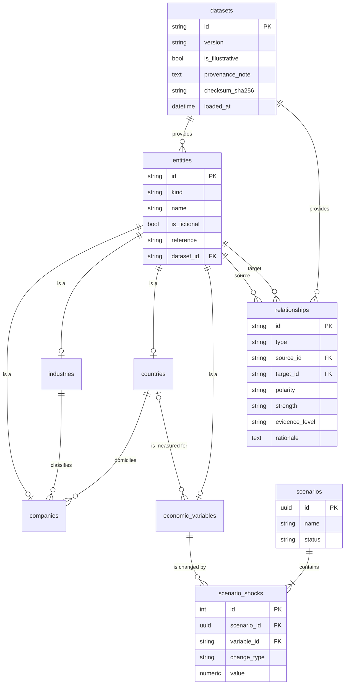

# Data model

RUMIN stores four things in Phase 1: **datasets** (where reference data came from),
**entities** (companies, industries, countries, economic variables), **relationships**
between entities (modelling assumptions), and **scenarios** (user-defined changes to
variables). The same schema runs on SQLite (development) and PostgreSQL (production), and
is created only through Alembic migrations.

Field-level definitions and the contents of the sample dataset are in the
[data dictionary](data-dictionary.md).

## Entity–relationship diagram

## Entities: joined-table inheritance

Every entity has one row in `entities` (the fields all kinds share) and one row in the
table for its kind, with the same primary key:

| Table | Kind-specific columns |
|---|---|
| `companies` | `industry_id` → `industries.id`, `country_id` → `countries.id` |
| `industries` | `classification_system` (e.g. `ISIC Rev. 4`), `classification_code` (e.g. `19`) |
| `countries` | `iso_alpha2` (unique), `currency_code` (ISO 4217) |
| `economic_variables` | `unit`, `value_kind`, `frequency`, `category`, `country_id` → `countries.id` (nullable: Brent crude is global) |

This gives relationships one foreign-key target (`entities.id`) whatever the kinds they
connect, while kind-specific references stay real foreign keys — a company cannot point at
an industry that does not exist, in either database.

`entities.attributes` (JSON) is reserved for descriptive extras that do not warrant a
column yet. It is empty in the sample dataset.

## Relationships

A relationship is a curated, **assumed** effect or link between two entities: always
`epistemic_category = assumption`, with a written `description` and `rationale`, a
`polarity`, a `strength` and an `evidence_level` saying how well it is supported. It is
never an observation.

Integrity is enforced at three levels:

1. **Database**: foreign keys to `entities`, `CHECK (source_id <> target_id)`, valid enum
   values, and `UNIQUE (type, source_id, target_id)`.
2. **Registry** (`app/domain/relationship_types.py`): which entity kinds each type may
   connect, whether it is directed and whether it has a polarity (below).
3. **Seed loader**: every reference resolves, types connect allowed kinds, polarity is
   `not_applicable` exactly when the type has none, and any evidence level above
   `illustrative` must cite a reference.

| Type | Reads as | Directed | Polarity | Allowed source → target |
|---|---|---|---|---|
| `supplies_to` | supplies | yes | — | company → company, industry → industry |
| `lends_to` | lends to | yes | — | company → company |
| `competes_with` | competes with | no | — | company ↔ company |
| `affects_costs` | affects costs of | yes | yes | variable → company / industry |
| `affects_revenue` | affects revenue of | yes | yes | variable → company / industry |
| `affects_financing` | affects financing costs of | yes | yes | variable → company / industry |
| `influences` | influences | yes | yes | variable → variable |

**Polarity** describes the assumed direction of effect: `positive` means an *increase* in
the source is assumed to *increase* the target measure (its costs, revenue, financing
costs, or the target variable). A positive cost effect is therefore usually bad for
margins. `mixed` means it can go either way depending on circumstances.

### Structural links (derived, not stored)

`/api/v1/network` also returns three structural link types, computed from entity columns
at query time so they can never disagree with the records: `in_industry` (company →
industry), `domiciled_in` (company → country) and `measured_for` (variable → country).

## Scenarios

`scenarios` holds a draft's `name`, `description`, `status` and timestamps;
`scenario_shocks` holds its 1–10 changes, in order (`position`):

- `variable_id` → `economic_variables.id` (`RESTRICT`: a variable in use cannot vanish);
- `change_type` (`percent_change` | `absolute_change`) and `value` as `NUMERIC(14, 4)` —
  exact decimals, never binary floating point;
- `UNIQUE (scenario_id, variable_id)`: a variable is changed at most once per scenario.

`status` can only be `draft` (enforced by a CHECK constraint). There is **no table for
simulation runs or results**: none exist until the Phase 4 engine, and the API reports
`latest_run: null`.

## Datasets and provenance

Every entity and relationship belongs to a `datasets` row (`RESTRICT` on delete), which
records the dataset's version, whether it is illustrative, a provenance note, its licence,
the SHA-256 checksum of the file it was loaded from, and when it was loaded. The system
page and `/api/v1/system` show this, so the origin of what is on screen is always visible.

## Enumerations

Enumerations are stored as `VARCHAR` with a `CHECK` constraint, not native database enum
types: identical on SQLite and PostgreSQL, readable in raw SQL, and changed by an ordinary
migration.

| Enumeration | Values |
|---|---|
| Entity kind | `company`, `industry`, `country`, `economic_variable` |
| Relationship type | `supplies_to`, `lends_to`, `competes_with`, `affects_costs`, `affects_revenue`, `affects_financing`, `influences` |
| Structural link type (derived) | `in_industry`, `domiciled_in`, `measured_for` |
| Polarity | `positive`, `negative`, `mixed`, `not_applicable` |
| Strength | `weak`, `moderate`, `strong` |
| Evidence level | `illustrative`, `documented`, `estimated`, `validated` |
| Value kind | `price`, `rate`, `exchange_rate`, `index` |
| Frequency | `daily`, `weekly`, `monthly`, `quarterly`, `annual`, `irregular` |
| Variable category | `commodity`, `monetary_policy`, `exchange_rate`, `inflation` |
| Change type | `percent_change`, `absolute_change` |
| Scenario status | `draft` |
| Epistemic category | `observation`, `assumption`, `scenario_input`, `simulated_output`, `uncertainty` |

## Conventions

- **Timestamps** are timezone-aware UTC (`TIMESTAMP WITH TIME ZONE` on PostgreSQL; stored
  as UTC and returned with `Z` on SQLite).
- **Constraint names are deterministic** (`ck_<table>_<name>`, `uq_<table>_<columns>`,
  `ix_<table>_<column>`, …), so migrations can reference them on both databases.
- **IDs** of reference data are stable, readable slugs (`co_deltrin_refining`), so a
  dataset can be reloaded without breaking links or saved scenarios.

## Migrations

Alembic, in `backend/migrations/`. `0001_initial_schema` creates all nine tables.

- Every schema change is a new revision: edit the models, run
  `uv run alembic revision --autogenerate -m "…"`, **review the generated file**, apply it
  with `uv run alembic upgrade head`.
- Migrations run in batch mode so the same revision works on SQLite (which cannot alter
  most constraints in place) and PostgreSQL.
- Tests build their database with the real migrations (not `create_all`), check that the
  migrated schema matches the models exactly, and check that downgrading to empty and
  upgrading again works.
- `/health/ready` reports "not ready" until the database is at the latest revision.
