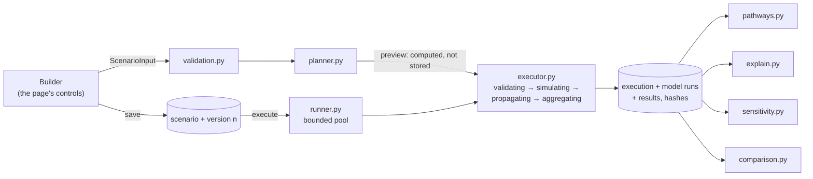

# Scenario Lab architecture

How a scenario is stored, planned, executed, combined and checked. The Lab is built **on**
the Phase 4 engine, not beside it: every model runs through `engine.prepare` and
`engine.execute`, and every model run is stored as an ordinary Phase 4 run with its
provenance, so it can be opened and verified on its own.

## The scenario object

A scenario has a stable identity and **immutable, numbered versions**
(`backend/app/scenario_lab/spec.py` defines the specification each version stores).

| Part | What it holds |
|---|---|
| Changes | 1–10 changes on knowledge-graph variables: `percent_change` for prices and exchange rates, `absolute_change` in percentage points for rates, each within the variable's published limits (at most four decimal places) |
| Timing | start month, duration (0 = to the end of the horizon), horizon of 1–36 months |
| Subject | optionally a company of the knowledge graph |
| Company | reporting currency, annual revenue, annual operating costs — shared by every model |
| Markets | the exchange rate: typed, or a stored observation (by series) |
| Models | per model: `auto`, `include` or `exclude`, its own inputs and assumptions |
| Constraints | graph relationships must be evidence-backed; market baselines must come from stored data |
| Stress cases | up to five: a multiple of every change (above 0, at most 10) or explicit values |

**Saving never overwrites.** A save that changes anything adds a version; a save that
changes nothing adds none; a save made from an older version than the latest (the request
names its `base_version`) is refused with **409**, so no edit is lost. Restoring a version
saves its content as a new version; duplicating starts a new scenario. An executed scenario
cannot be deleted (409): its executions must stay reproducible. Each version stores a hash
of its specification.

Phase 1 drafts were converted by migration `0005` into scenarios with a version 1.

## Validation

`validation.py` checks everything at once and reports each problem with the field it
concerns (`shocks[1].value`, `models.fx_exposure.inputs.annual_usd_costs`, …): unknown or
duplicated variables, changes outside the published limits, more than four decimal places,
timing outside the horizon, figures that are not plain numbers or not in [0, 10¹⁵), unknown
models or inputs, stress cases that would push a change outside its limits (**refused, never
clipped**) and duplicate stress-case names. The builder shows the API's message on the
field; it applies no domain rule of its own.

## The plan

`planner.py` lists **every** Lab model with a status and its reasons:

| Status | Meaning |
|---|---|
| `included` | it will run: its inputs are valid, every graph relationship it needs is confirmed (`engine.prepare`), and it meets the constraints |
| `blocked` | it would run, but an input is missing or invalid, a relationship is not confirmed or a constraint is not met; each problem is listed with its field |
| `available` | a change reaches it but it is not included by default (no company chosen, or the graph does not state the company's exposure); the user may include it |
| `excluded` | applicable, and excluded by the user |
| `not_applicable` | none of the changes reaches it, or the graph does not state the exposure it needs |

A model is **included by default** only when a company is chosen *and* the graph states the
exposure the model requires — directly, or through the company's industry. That statement
decides *whether* a model applies, never *how much*: the amounts come from the user's
figures and the model's equations. Models declare what they need in their **scenario
profile** (`profiles.py`): the variables they accept, the line items they contribute to
(from a closed list), the exposures that make them apply. No two models may claim the same
item of the same line, and pairs that must not both carry a quantity are listed as cautions
(for example, leave jet fuel out of the US-dollar costs: the airline model already converts
the fuel bill).

A plan is **executable** only if every change is simulated by an included model, no
included model is blocked, no two models claim the same item and every stress case is
valid. Nothing is filled in to make a plan executable. The plan also lists the companies the
graph ties to the changes (within two `influences` hops, at most 200 entities) and which of
those ties a model covers — for context; nothing is computed for them.

## Execution

`POST /scenarios/{id}/executions` validates and plans again (422 if the plan is not
executable, nothing stored), reserves a place in the worker pool (**429** `rate_limited`
when there is none, before anything is stored), stores the execution as `queued` and
answers **202**. The page follows it with `GET /scenario-executions/{id}` at the interval
the server asks for (`poll_after_ms`).

`executor.py` moves through four stages, each stored with its start and end time **as it
happens**:

| Stage | Work |
|---|---|
| `validating` | the plan is rebuilt; every included model's inputs are validated, stored data resolved and graph relationships confirmed — all or nothing |
| `simulating` | each model is executed by the Phase 4 engine (transmission along graph relationships, equations, contributions); stress cases are evaluated with the same models and assumptions |
| `propagating` | each change is followed through the models' runs: the variables it moved, the relationships and parameters that carried it, the line items it changed, month by month |
| `aggregating` | the Lab's equations combine the models into lines and metrics, the timeline and its events and the stress cases; every model run is stored as a Phase 4 run and the results with their hashes, **in one transaction** |

Cancellation (`POST …/cancel`, which only sets a flag — 409 once the execution is final) and
the time limit (`RUMIN_SCENARIO_TIMEOUT_SECONDS`, 20 s by default) are checked between
stages and between models. A failed, cancelled or timed-out execution stores nothing but its
state and the reason. **Once final, an execution never changes.**

### The runner

`runner.py` runs executions on a small thread pool inside the API process: at most
`RUMIN_SCENARIO_MAX_CONCURRENT` at once (2) and `RUMIN_SCENARIO_MAX_QUEUED` waiting (8);
beyond that a request is refused, never queued without bound. When the server starts, any
execution left unfinished by a stopped process is marked failed (`interrupted`), so none
stays "running" for ever. `RUMIN_SCENARIO_EXECUTION_MODE=inline` runs each execution inside
the request that created it (the tests use it). The pool is per process: with several API
processes each has its own limits; a shared job queue is Phase 10 work.

Every change of an execution's state — each stage, the final state, recovery, a
cancellation request — is a conditional update that applies only while the execution is
not final, in the same transaction as what it records (the results and every model run,
for a completed execution). A run that finds its execution already final stops at its
next checkpoint and stores nothing. So a final execution never changes, even if a second
API process were started: its recovery cannot tell another process's live executions from
abandoned ones and marks them interrupted, which is why the Lab is run as one API process.

## The Lab's equations

Every model of a scenario shares one reporting currency, one horizon and one set of company
figures, so their contributions add without conversion (`aggregate.py`):

| Id | Equation |
|---|---|
| AG0 | Baselines over the horizon: R·H/12; O·H/12; (R − O)·H/12; I·H/12; (R − O − I)·H/12 — the user's annual figures held constant: inputs, not forecasts |
| AG1 | Change in revenue: ΔR = Σ the models' revenue items (fare recovery, US-dollar revenue, price recovery) |
| AG2 | Change in operating costs: ΔO = Σ the models' cost items (fuel, US-dollar costs, linked inputs) |
| AG3 | Change in operating profit: ΔΠ = ΔR − ΔO, checked against Σ each model's own operating-profit change (tolerance 10⁻⁹) |
| AG4 | Change in interest expense: ΔI = Σ the interest items |
| AG5 | Change in profit before tax: ΔP = ΔΠ − ΔI (operating profit held at its baseline when no included model changes it) |
| AG6 | Operating margin: μ₀ = (R − O)/R; μ₁ = (R·H/12 + ΔR − O·H/12 − ΔO)/(R·H/12 + ΔR) |
| AG7 | Interest coverage: κ₀ = (R − O)/I; κ₁ = ((R − O)·H/12 + ΔΠ)/(I·H/12 + ΔI) |

A line no included model contributes to is **not shown**: it is not modelled, which is not
the same as unchanged. Profit before tax therefore appears only when an interest model is
included (it needs the interest baseline). **Cash flow is never shown**: no model covers
working capital, tax or investment. Each line also carries its change **by variable**:
Shapley values within each model (Phase 4), added across models.

All arithmetic uses exact decimals (34 significant digits); results are rounded half to
even to 10 decimal places for output. Values travel as decimal strings in the API.

## Stress cases

Up to five alternative magnitudes of the same changes — a multiple of every change, or
explicit values — evaluated in the `simulating` stage with **the same models and
assumptions**. A stress value outside a variable's limits is refused with the field, never
clipped. Results show each case's lines and metrics beside the scenario's; nothing is ranked.

## Sensitivity

`sensitivity.py` runs a **one-at-a-time** analysis on a stored execution: each selected
quantity — a change, a shared figure or one model's input or assumption — is moved on its
own while everything else keeps the execution's value; every model that uses it is
re-evaluated and the Lab's aggregation recomputed; quantities are ranked by the spread they
cause (a tornado chart). Points outside an input's range, or that break a model's rules, are
skipped and reported — never clipped. At most 8 quantities, 7 points each, 60 evaluations
and a deadline. **It is not Monte Carlo**: no probabilities are involved, and the spread says
how much the result depends on a quantity, not how likely any value is. Analyses are stored.

## Explanation

`explain.py` answers *what caused this?* for a line or metric of an execution, from what the
execution and its runs stored: the Lab's aggregation step and its terms, each change's
contribution, and for each model its changes and inputs → equations → the intermediate
steps of a worked month → the graph relationships and transmission paths → its output, with
the model version, definition hash, assumptions (and whether each is a default), data and
graph snapshots, limitations and warnings. There is no generated text.

## Comparison

`comparison.py` sets 2–6 completed executions side by side: their changes, models, every
line and metric, the inputs and assumptions that differ, the pathway links that differ and,
where analysed, their sensitivity rankings. Differences against the chosen reference are
computed **only** between executions with the same currency and horizon; otherwise values
are shown side by side, not differenced. Nothing is ranked or recommended.

## Reproducibility

Each execution stores an **inputs hash** — the Lab version, the version's specification
hash and, for each model, its version, definition hash, scenario-profile hash and its run's
own inputs hash (which includes the engine version) — and a **result hash**. `POST …/verify`
re-executes the stored runs from what they stored — their inputs, observations and graph
snapshot, never current data — recomputes the Lab's aggregation and compares both hashes.
A model version that is no longer registered with the same definition cannot be re-executed;
the stored results remain valid and the check says so.

## Versions and hashes in play

| Version | Value | Where |
|---|---|---|
| Lab version | `1.0.0` | `app/scenario_lab/__init__.py` (`LAB_VERSION`), in every inputs hash |
| Engine version | `1.0.0` | unchanged from Phase 4: the engine extensions leave every existing result unchanged |
| Model versions | see [the registry](../simulation/registry.md) | each run records its definition hash |
